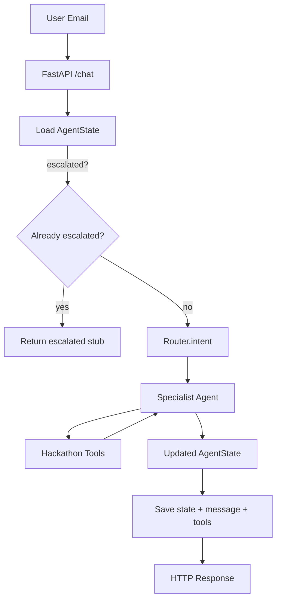

### High-Level Architecture

- **FastAPI layer**: Keep using `api/server.py` as the single HTTP entrypoint, but adapt it to the hackathon contract by:
  - Mapping `conversationId` → `conversation_id`, and customer identity fields into `AgentState.customer_info`.
  - Ensuring continuous memory by always loading + extending `state.messages` via `Checkpointer`.
  - Returning a response shape that exposes at least: final assistant message, tool traces from `internal_data`, and key state flags (`is_escalated`, `current_workflow`, `workflow_step`).
- **Persistence**: Keep using `core.database.Checkpointer` (SQLite `state.db`) as the source of truth for:
  - Threads and messages (for continuous memory and observability).
  - Full serialized `AgentState` snapshots (for resuming flows and detecting escalated threads).
- **Routing layer**: Extend `router.logic` to perform real intent classification against the hackathon use cases using OpenAI and `INTENT_CLASSIFICATION_PROMPT`, returning intents like `shipping_delay`, `wrong_or_missing_item`, `no_effect`, `refund_request`, `order_modification`, `positive_feedback`, `subscription_issue`, `discount_problem`.
- **Specialist agents**: Keep `BaseAgent` plus per-domain agents but:
  - Wire `agents/shipping/graph.py` as the main implementation for the Shipping Delay / WISMO flow.
  - Gradually add other agents (`defect`, `subscription`, `refund`, `order_mod`, `discount`, `positive_feedback`) that mirror the workflow manual.
- **Tools layer**:
  - Implement hackathon tools as Python adapters returning `ToolResponse` (already scaffolded in `schemas/internal.py`).
  - Keep all external interactions observable by writing tool name, inputs, and outputs into `state.internal_data["tool_traces"]`.
- **Escalation**:
  - Use the `AgentState.is_escalated` flag and an `internal_data["escalation_summary"]` (based on `EscalationSummary`) as the single source of truth.
  - Enforce that once a thread is escalated, `api/server.chat` short-circuits and never runs routing/agents again.

### Step 1 – Align API and State with Hackathon Requirements

- **1.1 Adapt FastAPI request/response to email use case**
  - Add a dedicated email session start schema (or reuse `ChatRequest`) that includes: customer email, first name, last name, Shopify customer ID, and the first message.
  - In the handler, populate `AgentState.customer_info` (`email`, `first_name`, `last_name`, `shopify_customer_id`) from the payload.
  - Ensure `AgentState.messages` is always updated with each inbound message using `add_messages` semantics from `core/state.py`.
- **1.2 Continuous memory**
  - Confirm `Checkpointer.load_state` and `save_state` are used exactly once per `/chat` call to read and then persist `AgentState`.
  - Keep logging inbound and outbound messages to the `messages` table so multi-turn email threads are automatically stored.
- **1.3 Observable responses**
  - Adjust `ChatResponse` to include, in `state`, at minimum:
    - `last_assistant_message` (string or structured messages slice).
    - A `tool_traces` list under `internal_data` with `{name, inputs, output}` objects.
    - Escalation metadata: `is_escalated`, `escalation_summary`, `current_workflow`, `workflow_step`.

### Step 2 – Shipping Delay (WISMO) Workflow E2E

- **2.1 Finalize shipping graph semantics** in `[agents/shipping/graph.py](agents/shipping/graph.py)`:
  - Re-use existing nodes `node_check_order_status` and `node_decide_wait_or_escalate`, verifying they match the workflow manual:
    - Step 1: Check order status; handle missing Shopify ID and tool failure via escalation with `EscalationSummary` and a clear assistant message.
    - Step 2: If `UNFULFILLED`, explain it has not shipped yet.
    - Step 3: If `IN_TRANSIT`, compute wait promise based on current weekday (Mon–Wed → Friday; Thu–Sun → upcoming Monday) and store `wait_promise_until` in `internal_data`.
    - Step 4: If `DELIVERED`, explain it is marked delivered.
    - Step 5: If `today > wait_promise_until` and status is not `DELIVERED`, set `is_escalated=True` and write an `escalation_summary(reason="wismo_missed_promise", ...)`.
  - Ensure every node appends its decision and any tool calls to `internal_data["tool_traces"]` for observability.
- **2.2 Wire shipping graph into a concrete agent**
  - In `[agents/wismo/graph.py](agents/wismo/graph.py)`, replace the stub `build_graph` and `handle` implementation with:
    - `build_graph` returning `build_shipping_graph()` from `agents/shipping/graph.py` compiled with `Checkpointer.langgraph_saver`.
    - `handle` that:
      - Ensures `state.current_workflow = "shipping"`.
      - Runs one graph execution step (or a simple `app.invoke` for now) with the current `AgentState`.
      - Returns the updated state.
  - Keep WISMO’s prompts (`agents/shipping/prompts.py`) in mind but focus on deterministic logic already encoded in the graph.
- **2.3 Routing to WISMO**
  - In `[router/logic.py](router/logic.py)`, replace the stub `classify_intent` with an OpenAI-based classifier that:
    - Uses the `INTENT_CLASSIFICATION_PROMPT` and passes the latest user message + short history.
    - Returns `intent="shipping_delay"` and `routed_agent="wismo"` for messages matching the Shipping Delay manual (e.g., "Where is my order?", "Any update on shipment?", etc.).
    - Keeps other intents reserved for later steps.
  - Set `state.intent` and `state.routed_agent` accordingly in `route`.

### Step 3 – Tool Adapters for Shipping

- **3.1 Implement hackathon tools behind `agents/shipping/tools.py**`
  - Replace mock implementations with real HTTP calls to the provided API (e.g., `shopify_get_customer_orders`, `shopify_get_order_details`) using the uniform JSON contract.
  - Wrap responses in `ToolResponse` and perform minimal validation:
    - On non-`success`, set `success=False` and fill `error`.
    - On `success=True`, normalize to keys consumed by the graph: `order_id`, `status`, `tracking_url`, etc.
- **3.2 Tool observability**
  - Store `<tool_name, inputs, raw_output>` in `state.internal_data["tool_traces"]` inside each tool node (or directly inside tool adapters).
  - Ensure `tool_traces` is returned via the API in the `state` for each `/chat` call.

### Step 4 – Escalation Semantics

- **4.1 Single source of truth for escalation**
  - Standardize the pattern (as already used in `agents/shipping/graph.py`):
    - When escalation is required, set `state.is_escalated = True` and `state.escalated_at` (UTC timestamp).
    - Attach an `EscalationSummary` under `internal_data["escalation_summary"]` with `reason` and key context (order id, status, promise date, error messages).
    - Append a final assistant message informing the customer that Monica / a human is taking over and that automation stops.
  - In `api/server.chat`, keep the early-return guard for already escalated threads and make the return payload explicit about the escalated status.
- **4.2 Enforce no further automation after escalation**
  - Ensure that any agent or graph node checks `state.is_escalated` and short-circuits if set, only acknowledging that a human is now responsible.
  - Confirm that no tools are called and no new promises are made after escalation.

### Step 5 – Observability / Tracing

- **5.1 Thread and message inspection**
  - Rely on `Checkpointer.get_thread` and direct SQLite inspection for debugging.
  - Optionally add a simple read-only FastAPI endpoint like `/thread/{conversation_id}` that:
    - Returns thread metadata (`status`, `current_workflow`, `workflow_step`, `is_escalated`, `escalated_at`).
    - Returns all messages from the `messages` table for that thread.
- **5.2 Tool traces in API**
  - Confirm that `internal_data["tool_traces"]` is always present (maybe empty list) and is logged in response JSON for each `/chat` call.

### Step 6 – Generalizing to Other Use Cases (After Shipping is Solid)

Once the Shipping Delay pipeline is robust and tested, extend the pattern:

- **6.1 New intents and agents**
  - Extend `INTENT_CLASSIFICATION_PROMPT` and classifier logic to cover:
    - `wrong_or_missing_item` → `defect` agent.
    - `no_effect` → `product_issue` agent.
    - `refund_request` → `refund` agent.
    - `order_modification` → `order_mod` agent.
    - `positive_feedback` → `positive_feedback` agent.
    - `subscription_issue` → `subscription` agent.
    - `discount_problem` → `discount` agent.
  - Create or extend agent graphs in `agents/*/graph.py` that encode each manual step (ask reason, request photos, offer reship/store credit/refund, etc.), following the same micro-state-machine approach as Shipping.
- **6.2 Shared patterns**
  - Reuse `ToolResponse` and `EscalationSummary` for all tools and escalations.
  - Keep continuous memory and escalation semantics identical across all flows.

### Step 7 – README and Presentation

- **7.1 Update README**
  - Document:
    - How to run the system (Docker and bare-metal, including required environment variables like `API_URL`, `OPENAI_API_KEY`).
    - High-level architecture: router, agents, tools, checkpointer, escalation.
    - How the Shipping Delay workflow is implemented end-to-end.
  - Add a short section on how to inspect a session’s decisions (where tool traces and escalation summaries live).
- **7.2 Demo script**
  - Prepare 2–3 example conversations (e.g., neutral shipping delay, missed promise leading to escalation) to showcase correctness, continuous memory, and observability during the hackathon presentation.

