# Lookfor Hackathon 2026 - Team Munich

AI-powered multi-agent customer support system for e-commerce brands.

## Quick Start

```bash
# 1. Clone the repo
git clone https://github.com/atadagg/Lookfor_Hackathon_2026_Munich.git
cd Lookfor_Hackathon_2026_Munich

# 2. Add your API keys to backend/.env
cp .env.example backend/.env
# Edit backend/.env and set OPENAI_API_KEY and API_URL

# 3. Run everything with Docker
docker-compose up --build
```

- **Frontend**: http://localhost:3000
- **Backend API**: http://localhost:8000
- **API Docs**: http://localhost:8000/docs

## Architecture

### 📁 Project Structure

```
├── backend/           # Python (FastAPI + LangGraph)
│   ├── api/           # FastAPI server, /chat and /thread endpoints
│   ├── agents/        # 8 specialist agents (WISMO, refund, etc.)
│   ├── core/          # State, database, LLM client, base agent classes
│   ├── router/        # Intent classification / routing
│   ├── schemas/       # Pydantic models
│   ├── tools/         # 18 hackathon tools (Shopify + Skio)
│   └── tests/         # Integration tests
├── frontend/          # Next.js + Shadcn UI dashboard
│   └── src/
│       ├── app/       # App router pages
│       ├── components/# Mail-like UI components
│       └── lib/       # API client
├── docker-compose.yml # One-click orchestration
└── README.md
```

### 🔄 System Flow

```mermaid
flowchart TB
    subgraph "Customer"
        A[👤 Customer Email]
    end
    
    subgraph "Frontend Dashboard"
        B[📧 Next.js UI]
    end
    
    subgraph "FastAPI Backend"
        C[🔌 POST /chat]
        D[(SQLite State DB)]
        E{🔐 Already<br/>Escalated?}
        F[📋 Return Escalation<br/>Message]
        
        subgraph "Router"
            G[🤖 LLM Intent<br/>Classification]
            H{Intent Type}
        end
        
        subgraph "Specialist Agents"
            I1[📦 WISMO Agent]
            I2[❌ Wrong Item Agent]
            I3[🔧 Product Issue Agent]
            I4[💰 Refund Agent]
            I5[✏️ Order Mod Agent]
            I6[💬 Feedback Agent]
            I7[🔄 Subscription Agent]
            I8[🎟️ Discount Agent]
        end
        
        subgraph "LangGraph Workflow"
            J[📊 Agent State Machine]
            K{Decision<br/>Point}
            L[🛠️ Tool Execution]
            M[📝 LLM Response<br/>Generation]
        end
        
        subgraph "External APIs"
            N[🛍️ Shopify API<br/>13 tools]
            O[💳 Skio API<br/>5 tools]
        end
        
        P[💾 Save State +<br/>Tool Traces]
        Q[📤 JSON Response]
    end
    
    A --> B
    B --> C
    C --> D
    D --> E
    E -->|Yes| F
    E -->|No| G
    F --> Q
    G --> H
    
    H -->|Shipping| I1
    H -->|Wrong Item| I2
    H -->|Product Issue| I3
    H -->|Refund| I4
    H -->|Order Mod| I5
    H -->|Feedback| I6
    H -->|Subscription| I7
    H -->|Discount| I8
    
    I1 & I2 & I3 & I4 & I5 & I6 & I7 & I8 --> J
    
    J --> K
    K -->|Need Data| L
    K -->|Ready| M
    L --> N & O
    N & O --> L
    L --> K
    M --> P
    P --> Q
    Q --> B
    B --> A
    
    style A fill:#e1f5ff
    style B fill:#fff4e6
    style G fill:#f3e5f5
    style I1 fill:#e8f5e9
    style I2 fill:#e8f5e9
    style I3 fill:#e8f5e9
    style I4 fill:#e8f5e9
    style I5 fill:#e8f5e9
    style I6 fill:#e8f5e9
    style I7 fill:#e8f5e9
    style I8 fill:#e8f5e9
    style N fill:#ffe0b2
    style O fill:#ffe0b2
```



### 🤖 Detailed Agent Flow

```mermaid
flowchart LR
    subgraph "Agent Internal Flow"
        A1[🎯 Check Order Status]
        A2[📊 Internal Data]
        A3{Status?}
        A4[⏱️ Wait Promise]
        A5[⚠️ Escalate]
        A6[✅ Respond]
        
        A1 --> A2
        A2 --> A3
        A3 -->|Delayed| A4
        A3 -->|Problem| A5
        A3 -->|OK| A6
    end
    
    style A1 fill:#bbdefb
    style A2 fill:#c5e1a5
    style A4 fill:#fff9c4
    style A5 fill:#ffccbc
    style A6 fill:#c8e6c9
```



### Agent System

| Agent | Handles |
|-------|---------|
| `wismo` | Shipping delay / Where Is My Order |
| `wrong_item` | Wrong or missing items in parcel |
| `product_issue` | Product "no effect" complaints |
| `refund` | Standard refund requests |
| `order_mod` | Order cancellation & address changes |
| `feedback` | Positive customer feedback |
| `subscription` | Subscription & billing issues (Skio) |
| `discount` | Discount / promo code problems |

### Routing

An LLM-based intent classifier (`router/`) analyzes the customer message and routes to the appropriate specialist agent. Each agent has its own system prompt, tool set, and workflow logic.

### Tools (18 total)

13 Shopify tools + 5 Skio subscription tools, all conforming to the Hackathon Tooling Spec. Tools make HTTP POST calls to `{API_URL}/hackathon/*` endpoints. When `API_URL` is not set, agents use built-in mock responses for development.

### Escalation

When the workflow manual requires escalation or the system cannot safely proceed:
1. The customer is informed their issue is being escalated
2. A structured `EscalationSummary` is generated (reason, context, recommended action)
3. The thread is marked `is_escalated = true` and automation stops

### 🔍 Observability (LangChain-Style Dashboard)

The frontend provides production-grade observability with real-time metrics:

#### 📊 Execution Metrics Dashboard
- Total tool calls with success rate visualization
- Multi-agent turn tracking
- Performance metrics (ms precision)
- Status indicators (Active/Escalated)

#### 📈 Performance Timeline
- Tool execution duration charts
- Relative performance comparison
- Success/failure color coding
- Total and average duration metrics

#### 🔄 Execution Flow Graph
- Step-by-step workflow visualization
- LLM classification nodes
- Tool calls with expandable I/O
- Error states with detailed context
- Timestamps for each operation

#### 📝 Dashboard Tabs
- **Message**: Full email thread UI
- **Trace**: Agent execution flow with timing data
- **Logs**: Complete tool I/O and JSON state

All metrics use **real data** from tool executions - no mocks!

## Demo / Testing

Test emails: `baki@lookfor.ai` and `ebrar@lookfor.ai`

### 1. Start the system

```bash
docker compose up --build -d
```

### 2. Test each workflow (copy-paste curls)

**WISMO (Shipping Delay):**
```bash
curl -s -X POST http://localhost:8000/chat \
  -H "Content-Type: application/json" \
  -d '{
    "conversation_id": "demo-wismo",
    "user_id": "baki",
    "channel": "email",
    "customer_email": "baki@lookfor.ai",
    "first_name": "Baki",
    "last_name": "Lookfor",
    "shopify_customer_id": "cust_baki",
    "message": "Where is my order? It has been days and still nothing arrived."
  }' | python3 -m json.tool
```

**Subscription Cancel (multi-turn):**
```bash
# Turn 1: customer wants to cancel
curl -s -X POST http://localhost:8000/chat \
  -H "Content-Type: application/json" \
  -d '{
    "conversation_id": "demo-sub",
    "user_id": "baki",
    "channel": "email",
    "customer_email": "baki@lookfor.ai",
    "first_name": "Baki",
    "last_name": "Lookfor",
    "shopify_customer_id": "cust_baki",
    "message": "I have too many stickers at home. I want to cancel my subscription."
  }' | python3 -m json.tool

# Turn 2: customer agrees to skip (stays with subscription agent)
curl -s -X POST http://localhost:8000/chat \
  -H "Content-Type: application/json" \
  -d '{
    "conversation_id": "demo-sub",
    "user_id": "baki",
    "channel": "email",
    "customer_email": "baki@lookfor.ai",
    "first_name": "Baki",
    "last_name": "Lookfor",
    "shopify_customer_id": "cust_baki",
    "message": "Yes please, lets skip the next order."
  }' | python3 -m json.tool
```

**Wrong Item:**
```bash
curl -s -X POST http://localhost:8000/chat \
  -H "Content-Type: application/json" \
  -d '{
    "conversation_id": "demo-wrong",
    "user_id": "ebrar",
    "channel": "email",
    "customer_email": "ebrar@lookfor.ai",
    "first_name": "Ebrar",
    "last_name": "Lookfor",
    "shopify_customer_id": "cust_ebrar",
    "message": "I received the wrong item in my package. I ordered BuzzPatch but got FocusPatch instead."
  }' | python3 -m json.tool
```

**Discount Code:**
```bash
curl -s -X POST http://localhost:8000/chat \
  -H "Content-Type: application/json" \
  -d '{
    "conversation_id": "demo-discount",
    "user_id": "baki",
    "channel": "email",
    "customer_email": "baki@lookfor.ai",
    "first_name": "Baki",
    "last_name": "Lookfor",
    "shopify_customer_id": "cust_baki",
    "message": "My discount code WELCOME10 says invalid at checkout."
  }' | python3 -m json.tool
```

**Positive Feedback:**
```bash
curl -s -X POST http://localhost:8000/chat \
  -H "Content-Type: application/json" \
  -d '{
    "conversation_id": "demo-feedback",
    "user_id": "ebrar",
    "channel": "email",
    "customer_email": "ebrar@lookfor.ai",
    "first_name": "Ebrar",
    "last_name": "Lookfor",
    "shopify_customer_id": "cust_ebrar",
    "message": "BuzzPatch saved our camping trip! No bites at all, the kids loved it!"
  }' | python3 -m json.tool
```

**Refund Request:**
```bash
curl -s -X POST http://localhost:8000/chat \
  -H "Content-Type: application/json" \
  -d '{
    "conversation_id": "demo-refund",
    "user_id": "ebrar",
    "channel": "email",
    "customer_email": "ebrar@lookfor.ai",
    "first_name": "Ebrar",
    "last_name": "Lookfor",
    "shopify_customer_id": "cust_ebrar",
    "message": "I want a refund for my order. The stickers did not work as promised."
  }' | python3 -m json.tool
```

**Product Issue (No Effect):**
```bash
curl -s -X POST http://localhost:8000/chat \
  -H "Content-Type: application/json" \
  -d '{
    "conversation_id": "demo-product",
    "user_id": "baki",
    "channel": "email",
    "customer_email": "baki@lookfor.ai",
    "first_name": "Baki",
    "last_name": "Lookfor",
    "shopify_customer_id": "cust_baki",
    "message": "The focus patches are not helping my son concentrate at all."
  }' | python3 -m json.tool
```

**Order Cancellation:**
```bash
curl -s -X POST http://localhost:8000/chat \
  -H "Content-Type: application/json" \
  -d '{
    "conversation_id": "demo-cancel",
    "user_id": "baki",
    "channel": "email",
    "customer_email": "baki@lookfor.ai",
    "first_name": "Baki",
    "last_name": "Lookfor",
    "shopify_customer_id": "cust_baki",
    "message": "I accidentally ordered twice, can you please cancel one?"
  }' | python3 -m json.tool
```

### 3. What to look for in the response

Every response includes full observability:
- `state.last_assistant_message` — the reply sent to the customer
- `state.agent_turn_history[].tool_traces` — every tool called with inputs/outputs
- `state.is_escalated` / `state.escalation_summary` — escalation status
- `state.intent` / `state.routed_agent` — how the message was classified
- `state.workflow_step` — where the agent is in its workflow

### 4. Frontend Dashboard

Open http://localhost:3000 for the visual dashboard with the email-style UI, execution traces, and performance metrics.

## Environment Variables

| Variable | Required | Description |
|----------|----------|-------------|
| `OPENAI_API_KEY` | Yes | OpenAI API key |
| `API_URL` | At eval | Hackathon tool endpoint base URL |

## Development

### With Docker (Recommended)

```bash
# Start all services
docker-compose up --build

# Run in background
docker-compose up -d --build

# View logs
docker-compose logs -f

# Stop services
docker-compose down
```

### Without Docker

```bash
# Backend
cd backend
pip install -r requirements.txt
uvicorn api.server:app --reload --port 8000

# Frontend
cd frontend
npm install
npm run dev
```

## Documentation

- See `backend/docs/` for detailed documentation
- API documentation available at http://localhost:8000/docs when running
